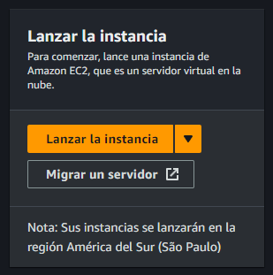
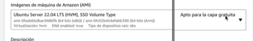
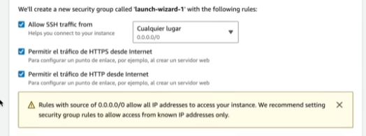

# EC2 - Creacion y configuración de una instancia

Al iniciar este servicio tenemos esta opción:

Es el primer paso para crear nuestro propio servidor. Tenemos que ponerle el nombre a este servidor, luego seleccionamos el OS, o imágen, queremos en este servidor.

*Es muy importante verificar que sea apto para la capa gratuita, si es que no queremos tener algun coste en el servidor.*

## Tipos de instancia

En el *Tipo de instancia* vamos a poder ver los recursos que va tener esta máquina. Es decir, las especificaciones, tanto de CPU, memoria, ancho de banda. Como siempre, si no queremos tener un coste en la instancia, seleccionamos todo los que sea de **Capa gratuita**.

Entre los tipos de instancia, debemos tener en cuenta el rendimiento de la *red*, puede que nos sea util esta caracteristica cuando necesitemos manejar demasiadas peticiones. Es obvio que las instancias pequeñas tienen un peor rendimiento de red.

## Par de claves

Podemos utilizar un de claves para conectarnos de forma segura a la instancia. De esta manera, nos deberia dejar conectar a través de SSH desde nuestro propia PC.

*No debemos compartir estas claves, ya que, son para el acceso a las PC's.*

## REDES

Nuestros servicios deben comunicarce dentro de la misma red, esto reduce la latencia.

Si lo requerimos, podemos identificar nuestra IP, para que solo sea accesible desde ese lugar. Tambien, permitimos los accesos HTTP y HTTPS, para los servidores web. Al crear un "Grupo de seguridad", establecemos los parametros anteriormente mencionados dentro de un grupo para poder reutulizarlos.

*En el almacenamiento, debemos avanzar con precaucion a la hora de desplegar de un proyecto, y no pasarnos de los limites gratuitos.*

Una vez finalizado podemos lanzar esta instancia EC2. Puede demorar algunos segundos en ejecutarce, pero cuando lo haga, nos dara una *ID de la instancia*, la cual nos permite ver las caracteristicas de la misma, como por ejemplo, la IPV4 (que puede ser publica o privada), si se trata de una web, un dominio puede estar apuntando a esta IPV4.

