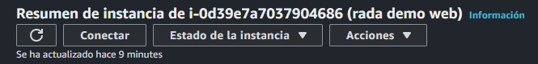
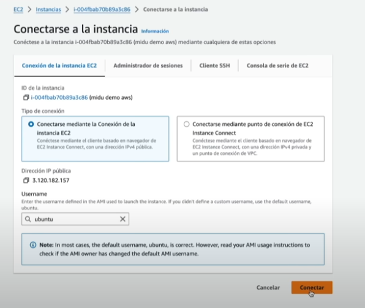

# Entrando a la PC

En este punto, tenemos un botón el cual dice "Conectar".



Y nos lleva a la ventana de conexiones.



La forma de conectar a través del navegador, nos permite eso, poder ingresar a en la web y hacer lo que necesitemos hacer. Pero en este caso utilizaremos un cliente SHH, que es una terminal. Ahi mismo nos da una serie de pasos a seguir para realizar esa conexion.

*Nota: Para realizar el uso equilante de CHMOD en windows debemos seguir estos pasos:*

```bash
$path = ".\test.txt"
icacls.exe $path /reset
icacls.exe $path /GRANT:R "$((Get-Acl -Path $path).Owner):(R)"
icacls.exe $path /inheritance:r
```
*El **path** es donde se encuentra el archivo .pem que es donde estan las llaves para la conexion SSH.*


Una vez realizado esto, deberíamos estar dentro de la maquina, y nos encontramos con la terminal de UBUNTU. Incluso podemos ejecutar el comando para actualizar.

```bash
sudo apt update	
```
Se pueden instalar tanto las actualizaciones como cualquier dependencias o frameworks que necesitemos, tales como NODE, MYSQL entre muchos. Se pueden crear archivos también. Todo esto utiliando los comandos de UBUNTU, como el **mkdir** para crear un directorio, y dentro usar el editor de texto **nano**, que lo podemos ejecutar con ese mismo nombre.

Incluso podemos levantar un servidor con Pyhton (que ya viene instalado por defecto)

```bash
sudo python3 -m http.server 80
```
**Lo levantamos en el puerto 80 (que es HTTP y no HTTPS)**

Ya realizado el archivo de HTML y levantado el servidor en el puerto 80, podemos visualizarlo en la IPv4 de nuestro servidor.

Podemos instalar varias versiones de NODEJS. Siguiendo este link podemos instalar fnm para obtener NODE: https://github.com/Schniz/fnm

Con esto, nuestro servidor se ha puesto en funcionamiento en el puerto 80 y, también, le instalamos NODEJS. 

*Es importante saber que: las instancias que no utilicemos, o no necesitemos, las terminemos. Podemos guardar el SNAPSHOT (copia de seguridad) si lo deseamos.*


