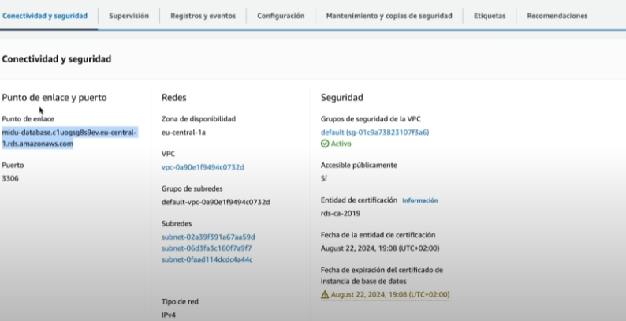
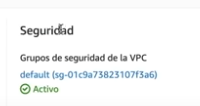
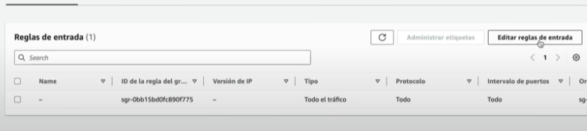
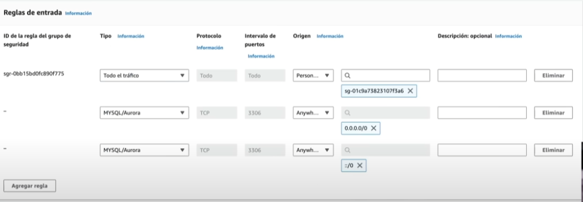

# Conexion a la BASE DE DAATOS

Habiamos creado la DB, con AMAZON RDS, ahora toca conectarce a la misma.



Tenemos el puerto de enlace. Ahora, a traves de la consola podemos ingresar a la DB con las siguientes credenciales.

```bash
mysql -h rada-db.ctkm0ak68eh3.us-east-2.rds.amazonaws.com -p 3306 -u admin -p
```
En el ultimo parametro, ponemos el password. Pero, de todas formas, no vamos a poder acceder de forma local, el grupo de seguridad de AWS no permite acceder al puerto 3306.



Para solucionar esto, entramos en este grupo, seleccionamos la ID y editamos las reglas de entrada.



Ahi mismo, tenemos que agregar una regla.



Agregamos las reglas, en las cuales, tanto la IPV4 y la IPV6 tienen los permisos para acceder a la base datos, puede ser cualquiera, pero podemos especificar nuestra IP especificamente.

Teniendo todo esto, tendriamos acceso total a nuestra Base de datos.
