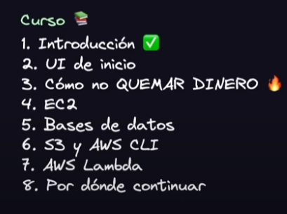

# AWS - CLOUD COMPUTING

Es uno de los servicios de *Cloud* mas utilizados. Todos los demás servicios hacen exactamente lo mismo. Cuando hacemos referencia al *Cloud*, hablamos (literalmente) de una PC virtual, la rentamos a un prestador de servicios. 

Hay muchos servicios en la *nube* y *AWS* es una conexión de servicios de computación en esta nube, tales como: almacenamiento, DB, correos, etc...

Hay muchas plataformas en la web que utilizan los servicio de AWS.

Conceptos:

## CLI

Vamos a instalar la linea de comandos de AWS (CLI). Esto nos permite, como su nombre lo indica, ejecutar los comandos de **Amazon Web Services**. Podemos comunicarnos con todos los servicios.

## Servicios

En el caso de un sitio web, este necesita de algunos servicios para poder funcionar correctamente. Tales como, el hospedaje, el enrutamiento, la base de datos, mailing, cola de eventos, transacciones, etc...

Para ofrecer un buen rendimiento y armonia en este sitio web (para evitar un **'spike'** o saturación inesperada), tenemos que *escalar* los servicios. Hay dos formas de escalar los servicios, uno sería *HORIZONTAL* y el otro *VERTICAL*. Este último haria que nuestro servidor fuera mas grande tanto el almacenamiento como las demas características, es decir, lo potenciamos, pero también se puede hacer de forma inversa, lo disminuimos. En el primero (que es HORIZONTAL), lo que hacemos es tener mas maquinas, mas distribuidas las cargas.
La elección de uno o el otro depende de las necesidades, cada uno tiene sus pros y sus contras. En el caso del VERTICAL, vamos a tener *downtime*, eso quiere decir que vamos a perder la conectividad en algun momento, eso no pasa en el horizontal, que al tener mas PC's al caer el *downtime* en alguna, se pasa la otra la conectividad, pero esa cantidad puede darnos problemas a la hora de realizar un mantenimiento en HORIZONTAL, todo lo contrario en el otro, al tratarse de solo una es mas sencillo y con un mas bajo coste que si tenemos varios duplicados de maquinas.

*Esta red de servicio esta distribuida por todo el mundo, podemos crearlos en las distintas regiones que provee AWS. Es muy importante saber que no todas las regiones tienen todos los servicios.*

Entre los muchos servicios se encuentra **"EC2"** **(Elastic Cloud Computing)**. Que es de lo mas similiar a un servidor de común conocimiento. Aquí podemos crear una instancia de una PC o máquina, podemos replicarla cuantas veces queremos a esa misma copia de la máquina. Se pueden tener imagenes de Ubuntu, Linux, etc..

