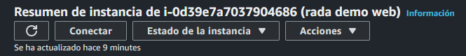

# Entrando a la PC

En este punto, tenemos un botón el cual dice "Conectar".



Y nos lleva a la ventana de conexiones.


La forma de conectar a través del navegador, nos permite eso, poder ingresar a en la web y hacer lo que necesitemos hacer. Pero en este caso utilizaremos un cliente SHH, que es una terminal. Ahi mismo nos da una serie de pasos a seguir para realizar esa conexion.

*Nota: Para realizar el uso equilante de CHMOD en windows debemos seguir estos pasos:*

```bash
$path = ".\test.txt"
icacls.exe $path /reset
icacls.exe $path /GRANT:R "$((Get-Acl -Path $path).Owner):(R)"
icacls.exe $path /inheritance:r
```
*El **path** es donde se encuentra el archivo .pem que es donde estan las llaves para la conexion SSH.*


Una vez realizado esto, deberíamos estar dentro de la maquina, y nos encontramos con la terminal de UBUNTU. Incluso podemos ejecutar el comando para actualizar.

```bash
sudo apt update	
```


